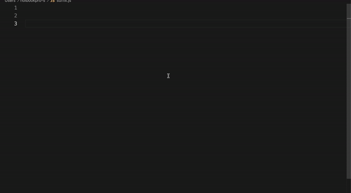

# GSAP GREENSOCK Snippets Extension

## Preview

## Features

GSAP GREENSOCK Snippets include snippets for some of the best and most used features of GreenSock.
From the basics **to** , **from** , **fromTo** to more elaborate snippets for **Draggable**,
**Flip** and of course **ScrollTrigger**.

On top of that, there are snippets for quick imports and registration, creating costume effects, utility methods and more.

If you think this extension is missing a useful snippet feel free to reach me out on [Twitter](https://twitter.com/MaxCodeJourney).

## Snippets

The snippets are is inspired by [GreenSock's](https://greensock.com/) documentation.

### Basics

| Snippet   | Purpose                                      |
| --------- | -------------------------------------------- |
| `gto`     | gsap.to(selector,{toVars})                   |
| `gfrom`   | gsap.from(selector,{fromVars})               |
| `gfromTo` | gsap.fromTo(selector, {fromVars}, {toVars}); |
| `gset`    | gsap.set(selector, {toVars});                |
| `gtl`     | Create gsap timeline                         |
| `gtt`     | Add new tween to timeline                    |

### Defaults and Register Effects

| Snippet    | Purpose                          |
| ---------- | -------------------------------- |
| `gdefault` | gsap.defaults({})                |
| `greff`    | Register costume effect snippet  |
| `guce`     | Use custom effect                |
| `gucetl`   | Use costume effect in a timeline |

### ScrollTrigger

| Snippet  | Purpose                                                        |
| -------- | -------------------------------------------------------------- |
| `gstt`   | Create a timeline with a scrollTrigger                         |
| `gsttcb` | Create a timeline with a scrollTrigger with callback functions |
| `gstc`   | Create Standalone ScrollTrigger                                |
| `gstccb` | Create Standalone ScrollTrigger with callbacks                 |

### Draggable

| Snippet | Purpose                              |
| ------- | ------------------------------------ |
| `gcd`   | Create gsap draggable with callbacks |

### Flip

| Snippet | Purpose                                |
| ------- | -------------------------------------- |
| `ggs`   | const state = Flip.getState(selector); |
| `gff`   | Flip.from                              |
| `gffcb` | Flip.from with callbacks               |

### Utility methods

| Snippet        | Purpose                  |
| -------------- | ------------------------ |
| `gprefix`      | gsap.utils.checkPrefix() |
| `gclamp`       | gsap.utils.clamp()       |
| `gdistribute`  | gsap.utils.distribute()  |
| `ginterpolate` | gsap.utils.interpolate() |
| `gclamp`       | gsap.utils.clamp()       |
| `gmapRange`    | gsap.utils.interpolate() |
| `gnormalize`   | gsap.utils.normalize()   |
| `gpipe`        | gsap.utils.pipe()        |
| `grandomnum`   | gsap.utils.random()      |
| `grandomarray` | gsap.utils.random([])    |
| `gselector`    | gsap.utils.selector()    |
| `gshuffle`     | gsap.utils.shuffle()     |
| `gsplitColor`  | gsap.utils.splitColor()  |
| `gtoArray`     | gsap.utils.toArray()     |
| `gunitize`     | gsap.utils.unitize()     |
| `gwrap`        | gsap.utils.gwrap()       |
| `gwrapYoyo`    | gsap.utils.wrapYoyo()    |

### Beyond the basic

| Snippet    | Purpose                              |
| ---------- | ------------------------------------ |
| `gcctx`    | create gsap context                  |
| `gcctxadd` | create gsap context and add function |
| `gaddtctx` | add to context                       |
| `gcm`      | create gsap media                    |
| `gmaad`    | add media                            |

### Imports and Register

#### (ES Modules)

| Snippet    | Purpose                                          |
| ---------- | ------------------------------------------------ |
| `gimp`     | import gsap (ES Modules)                         |
| `gimpfull` | import gsap, plugin and register it (ES Modules) |
| `gimpp`    | import plugin (ES Modules)                       |
| `gimppr`   | import and register plugin (ES Modules)          |

#### (UMD/CommonJS)

| Snippet       | Purpose                                             |
| ------------- | --------------------------------------------------- |
| `gimpdis`     | import gsap from dis folder                         |
| `gimpfulldis` | import gsap, plugin and register it from dis folder |
| `gimppd`      | import plugin from dis folder                       |
| `gimpprd`     | import and register plugin from                     |

## Happy tweening!

# gsap-snippets-vsc-extension
